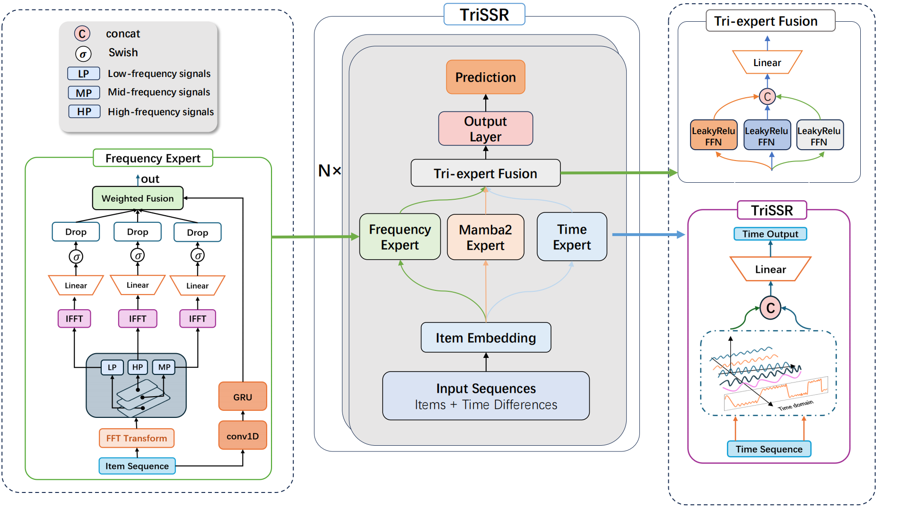
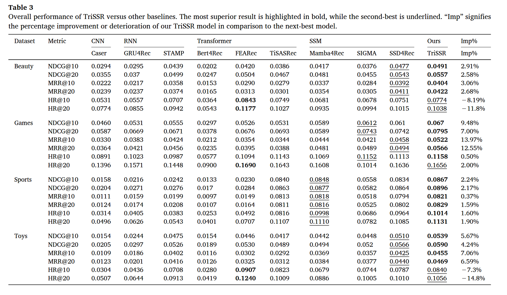

<p align="center">
  <a href="./README.md"></a>
  <a href="./README_zh.md"></a>
</p>

 [](https://github.com/zkLyons/IGTMRec)


# TriSSR: Tri-expert fusion in state space models for sequential recommendation

## 项目结构

```
TriSSR/
├── dataset
├── main.py                  # 训练与评估入口脚本
├── trissr.py                # 模型核心实现（TriSSR, TriSSRLayer, FrequencyLayer, TimeFourier, TriExpertFusion）
├── custom_utils.py          # 自定义数据集 & DataLoader
├── custom_trainer.py        # 自定义训练器（混合精度训练、评估逻辑、TensorBoard 日志）
├── config.yaml              # 模型与训练超参数配置
├── environment.yaml         # Conda 环境配置
├── images/
│   ├── model_architecture.pdf   # 模型架构图
│   ├── frequency_picture.pdf    # 频域滤波原理图
│   └── results.png              # 实验结果对比图
└── README.md
```

---

## 模型介绍

### 整体架构

这是我们发布在 **Neurocomputing** 上的文章：[TriSSR: Tri-expert fusion in state space models for sequential recommendation](https://www.sciencedirect.com/science/article/abs/pii/S0925231226009707)



## 论文简介

**TriSSR** 是一种新颖的序列推荐模型，创新性地融合了三种互补的特征提取范式：

1. **状态空间模型（Mamba2）**：以双向方式建模用户行为序列的长短期依赖关系
2. **频域滤波（Frequency Layer）**：在傅里叶频域对用户交互序列进行多波段（低/中/高频）分解与重构
3. **时间编码（TimeFourier）**：利用傅里叶特征对用户行为的时间间隔进行显式建模

三路特征经由可学习的 **TriExpertFusion** 融合器加权聚合，最终在多个公开数据集上取得了优越的推荐性能。

### 待解决的问题和解决方案

传统序列推荐模型面临以下挑战：

1. 用户行为包含短期兴趣与长期偏好，在频域呈现不同模式，但是这种简单的二级划分显然无法很好的描述用户特征，需要进行更细粒度的研究。

2. 用户兴趣随着时间不断变化，需要引入时间间隔信息作为用户特征建模的补充。

3. RNN/CNN 在长序列中易出现梯度消失或感受野不足，自注意力机制具有强大的长序列建模能力，但是却面临着巨大的计算消耗瓶颈。我们引入了 SSM 模型，兼具序列建模能力和线性计算复杂度。

## 实验结果



模型在四个 Amazon 公开数据集上与多种基线模型进行对比，评估指标包括 **NDCG@10/20**、**MRR@10/20** 和 **Hit@10/20**。实验结果表明 TriSSR 在所有数据集上均取得了具有竞争力的性能。

---

## 环境配置

通过 Conda 安装：

```bash
git clone https://github.com/zkLyons/TriSSR.git
cd TriSSR
conda env create -f environment.yaml
conda activate your_conda_env

```

所有实验均在 NVIDIA 24GB 3090 GPU 上进行。主要依赖包如下：

- Python 3.10
- PyTorch 2.1.1 + CUDA 11.8
- mamba-ssm 2.2.2
- RecBole 1.2.0
- causal-conv1d 1.4.0

## 数据集

我们使用了四个公开数据集，分别是 Amazon-Beauty、Amazon-Video-Games、Amazon-Sports 和 Amazon-Toys。设置步骤如下：

1. 创建 `dataset` 文件夹
2. 下载数据集：[Google Drive](https://drive.google.com/drive/folders/1jsF4n1dge4KgdfD8HKxNjOcyHUKdEHka)
3. 将数据文件放入 `dataset/` 目录下

数据集格式遵循 RecBole 的 Atomic File 格式（`.inter` 文件），包含 `user_id`、`item_id`、`timestamp` 三个主要字段。

---

## 快速启动

训练与评估：

```bash
python main.py
```

### 配置说明

所有超参数在 `config.yaml` 中配置，主要包括：

| 参数                   | 说明             | 默认值 |
| ---------------------- | ---------------- | ------ |
| `hidden_size`          | 特征维度         | 256    |
| `d_state`              | SSM 状态扩展维度 | 64     |
| `d_conv`               | 局部卷积宽度     | 4      |
| `expand`               | 块扩展因子       | 2      |
| `num_layers`           | TriSSR 层数      | 1      |
| `dropout_prob`         | Dropout 概率     | 0.4    |
| `beta`                 | 反向 Mamba 权重  | 0.1    |
| `maskratio`            | 序列掩码比例     | 0.2    |
| `learning_rate`        | 学习率           | 0.0001 |
| `train_batch_size`     | 训练批次大小     | 1024   |
| `MAX_ITEM_LIST_LENGTH` | 最大序列长度     | 50     |

切换数据集时，修改 `config.yaml` 中对应的数据集配置块，取消注释并注释其他数据集即可。

## 致谢

本项目基于以下优秀开源工作构建，在此表示衷心感谢：

- [SSD4Rec: A Structured State Space Duality Model for Efficient Sequential Recommendation](https://dl.acm.org/doi/10.1145/3773038)

- **Mamba / Mamba2**：[state-spaces/mamba](https://github.com/state-spaces/mamba) — 状态空间模型，为序列建模提供高效骨干网络
- **RecBole**：[RUCAIBox/RecBole](https://github.com/RUCAIBox/RecBole) — 推荐系统统一框架，提供数据处理、评估等基础设施

---

## 引用

如果您在研究中使用了 TriSSR，请引用我们的论文：

```
@article{Zhang2026TriSSR,
  title={TriSSR: Tri-expert fusion in state space models for sequential recommendation},
  author={Kang Zhang and Quan Wen and Yujian Huang and Yanmei Hu and Na Dong and Xiaomeng Yang and Ruixing Huang},
  journal={Neurocomputing},
  year={2026},
  volume={685},
  pages={133573},
  url={https://www.sciencedirect.com/science/article/abs/pii/S0925231226009707}
}
```
